# HMR Builders - Visual Flowcharts & Interaction Diagrams

This document contains visual flowcharts using Mermaid syntax for the HMR Builders Real Estate Tokenization Platform.

## Table of Contents
1. [System Architecture](#system-architecture)
2. [User Authentication Flows](#user-authentication-flows)
3. [Investment Transaction Flows](#investment-transaction-flows)
4. [Wallet Operations](#wallet-operations)
5. [KYC Process](#kyc-process)
6. [Admin Operations](#admin-operations)
7. [Data Models](#data-models)

---

## System Architecture

### High-Level System Architecture

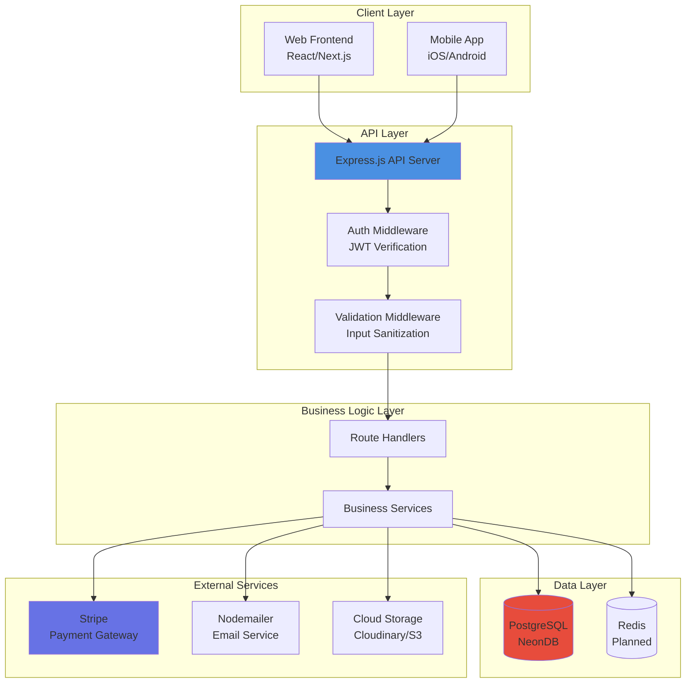
```mermaid
graph TB
    subgraph "Client Layer"
        WEB[Web Frontend<br/>React/Next.js]
        MOBILE[Mobile App<br/>iOS/Android]
    end
    
    subgraph "API Layer"
        API[Express.js API Server]
        AUTH[Auth Middleware<br/>JWT Verification]
        VALID[Validation Middleware<br/>Input Sanitization]
    end
    
    subgraph "Business Logic Layer"
        ROUTES[Route Handlers]
        SERVICES[Business Services]
    end
    
    subgraph "Data Layer"
        DB[(PostgreSQL<br/>NeonDB)]
        CACHE[(Redis<br/>Planned)]
    end
    
    subgraph "External Services"
        STRIPE[Stripe<br/>Payment Gateway]
        EMAIL[Nodemailer<br/>Email Service]
        STORAGE[Cloud Storage<br/>Cloudinary/S3]
    end
    
    WEB --> API
    MOBILE --> API
    API --> AUTH
    AUTH --> VALID
    VALID --> ROUTES
    ROUTES --> SERVICES
    SERVICES --> DB
    SERVICES --> CACHE
    SERVICES --> STRIPE
    SERVICES --> EMAIL
    SERVICES --> STORAGE
    
    style API fill:#4A90E2
    style DB fill:#E74C3C
    style STRIPE fill:#6772E5
```

### API Route Structure

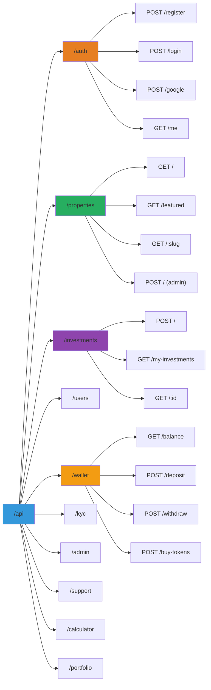
```mermaid
graph LR
    ROOT["/api"]
    
    ROOT --> AUTH["/auth"]
    ROOT --> PROP["/properties"]
    ROOT --> INV["/investments"]
    ROOT --> USER["/users"]
    ROOT --> WALL["/wallet"]
    ROOT --> KYC["/kyc"]
    ROOT --> ADM["/admin"]
    ROOT --> SUP["/support"]
    ROOT --> CALC["/calculator"]
    ROOT --> PORT["/portfolio"]
    
    AUTH --> AREG["POST /register"]
    AUTH --> ALOG["POST /login"]
    AUTH --> AGOOG["POST /google"]
    AUTH --> AME["GET /me"]
    
    PROP --> PLIST["GET /"]
    PROP --> PFEAT["GET /featured"]
    PROP --> PDET["GET /:slug"]
    PROP --> PCRE["POST / (admin)"]
    
    INV --> ICRE["POST /"]
    INV --> ILIST["GET /my-investments"]
    INV --> IDET["GET /:id"]
    
    WALL --> WBAL["GET /balance"]
    WALL --> WDEP["POST /deposit"]
    WALL --> WWITH["POST /withdraw"]
    WALL --> WBUY["POST /buy-tokens"]
    
    style ROOT fill:#3498DB
    style AUTH fill:#E67E22
    style PROP fill:#27AE60
    style INV fill:#8E44AD
    style WALL fill:#F39C12
```

---

## User Authentication Flows

### Registration Flow

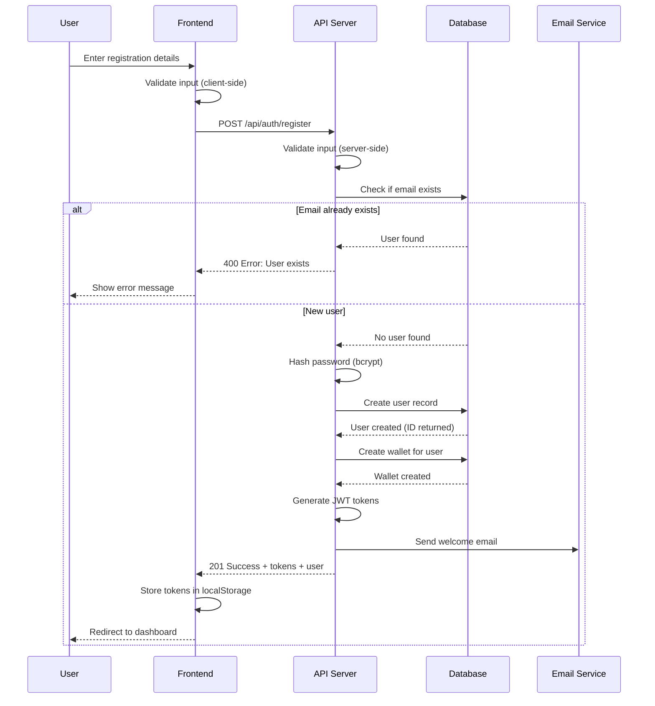
```mermaid
sequenceDiagram
    participant U as User
    participant F as Frontend
    participant A as API Server
    participant DB as Database
    participant E as Email Service
    
    U->>F: Enter registration details
    F->>F: Validate input (client-side)
    F->>A: POST /api/auth/register
    A->>A: Validate input (server-side)
    A->>DB: Check if email exists
    
    alt Email already exists
        DB-->>A: User found
        A-->>F: 400 Error: User exists
        F-->>U: Show error message
    else New user
        DB-->>A: No user found
        A->>A: Hash password (bcrypt)
        A->>DB: Create user record
        DB-->>A: User created (ID returned)
        A->>DB: Create wallet for user
        DB-->>A: Wallet created
        A->>A: Generate JWT tokens
        A->>E: Send welcome email
        A-->>F: 201 Success + tokens + user
        F->>F: Store tokens in localStorage
        F-->>U: Redirect to dashboard
    end
```

### Google OAuth Flow

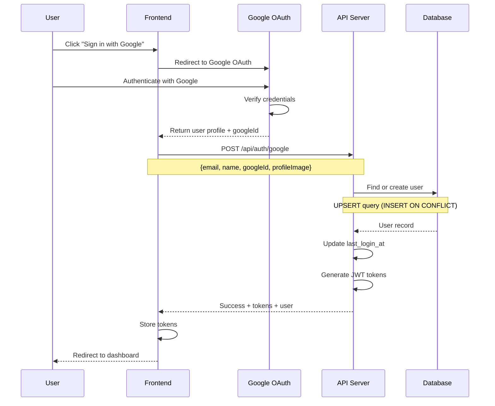
```mermaid
sequenceDiagram
    participant U as User
    participant F as Frontend
    participant G as Google OAuth
    participant A as API Server
    participant DB as Database
    
    U->>F: Click "Sign in with Google"
    F->>G: Redirect to Google OAuth
    U->>G: Authenticate with Google
    G->>G: Verify credentials
    G-->>F: Return user profile + googleId
    F->>A: POST /api/auth/google
    Note over F,A: {email, name, googleId, profileImage}
    
    A->>DB: Find or create user
    Note over A,DB: UPSERT query (INSERT ON CONFLICT)
    
    DB-->>A: User record
    A->>A: Update last_login_at
    A->>A: Generate JWT tokens
    A-->>F: Success + tokens + user
    F->>F: Store tokens
    F-->>U: Redirect to dashboard
```

### Login Flow with Token Refresh

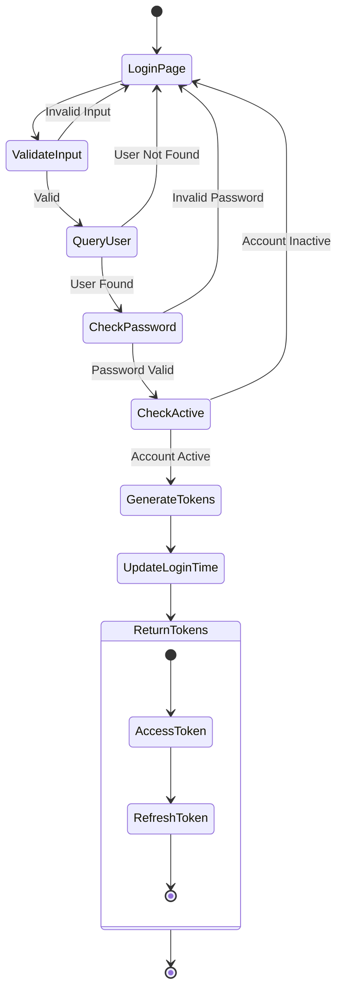
```mermaid
stateDiagram-v2
    [*] --> LoginPage
    LoginPage --> ValidateInput
    ValidateInput --> QueryUser: Valid
    ValidateInput --> LoginPage: Invalid Input
    
    QueryUser --> CheckPassword: User Found
    QueryUser --> LoginPage: User Not Found
    
    CheckPassword --> CheckActive: Password Valid
    CheckPassword --> LoginPage: Invalid Password
    
    CheckActive --> GenerateTokens: Account Active
    CheckActive --> LoginPage: Account Inactive
    
    GenerateTokens --> UpdateLoginTime
    UpdateLoginTime --> ReturnTokens
    ReturnTokens --> [*]
    
    state ReturnTokens {
        [*] --> AccessToken
        AccessToken --> RefreshToken
        RefreshToken --> [*]
    }
```

---

## Investment Transaction Flows

### Complete Investment Flow

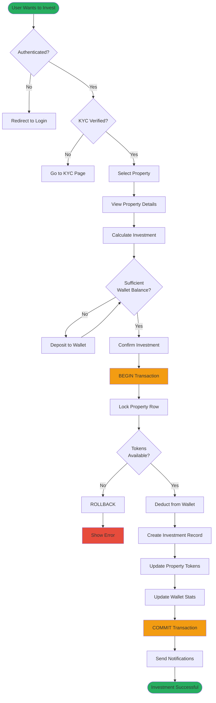
```mermaid
graph TD
    START([User Wants to Invest]) --> AUTH{Authenticated?}
    AUTH -->|No| LOGIN[Redirect to Login]
    AUTH -->|Yes| KYC{KYC Verified?}
    
    KYC -->|No| KYCPAGE[Go to KYC Page]
    KYC -->|Yes| SELECT[Select Property]
    
    SELECT --> DETAILS[View Property Details]
    DETAILS --> CALC[Calculate Investment]
    CALC --> WALLET{Sufficient<br/>Wallet Balance?}
    
    WALLET -->|No| DEPOSIT[Deposit to Wallet]
    DEPOSIT --> WALLET
    WALLET -->|Yes| CONFIRM[Confirm Investment]
    
    CONFIRM --> TXSTART[BEGIN Transaction]
    TXSTART --> LOCK[Lock Property Row]
    LOCK --> CHECKAVAIL{Tokens<br/>Available?}
    
    CHECKAVAIL -->|No| ROLLBACK1[ROLLBACK]
    ROLLBACK1 --> ERROR1[Show Error]
    
    CHECKAVAIL -->|Yes| DEDUCT[Deduct from Wallet]
    DEDUCT --> CREATE[Create Investment Record]
    CREATE --> UPDATE[Update Property Tokens]
    UPDATE --> UPDATEWALLET[Update Wallet Stats]
    UPDATEWALLET --> COMMIT[COMMIT Transaction]
    
    COMMIT --> NOTIFY[Send Notifications]
    NOTIFY --> SUCCESS([Investment Successful])
    
    style START fill:#27AE60
    style SUCCESS fill:#27AE60
    style ERROR1 fill:#E74C3C
    style TXSTART fill:#F39C12
    style COMMIT fill:#F39C12
```

### Token Purchase State Machine

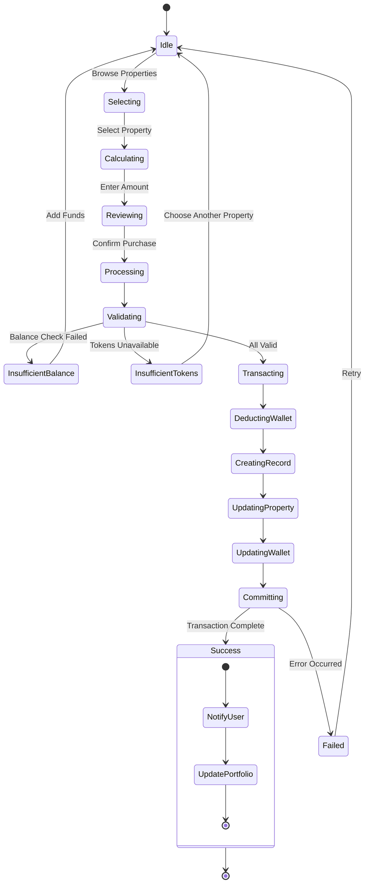
```mermaid
stateDiagram-v2
    [*] --> Idle
    Idle --> Selecting: Browse Properties
    Selecting --> Calculating: Select Property
    Calculating --> Reviewing: Enter Amount
    Reviewing --> Processing: Confirm Purchase
    
    Processing --> Validating
    Validating --> InsufficientBalance: Balance Check Failed
    Validating --> InsufficientTokens: Tokens Unavailable
    Validating --> Transacting: All Valid
    
    Transacting --> DeductingWallet
    DeductingWallet --> CreatingRecord
    CreatingRecord --> UpdatingProperty
    UpdatingProperty --> UpdatingWallet
    UpdatingWallet --> Committing
    
    Committing --> Success: Transaction Complete
    Committing --> Failed: Error Occurred
    
    InsufficientBalance --> Idle: Add Funds
    InsufficientTokens --> Idle: Choose Another Property
    Failed --> Idle: Retry
    Success --> [*]
    
    state Success {
        [*] --> NotifyUser
        NotifyUser --> UpdatePortfolio
        UpdatePortfolio --> [*]
    }
```

### Investment Transaction Sequence

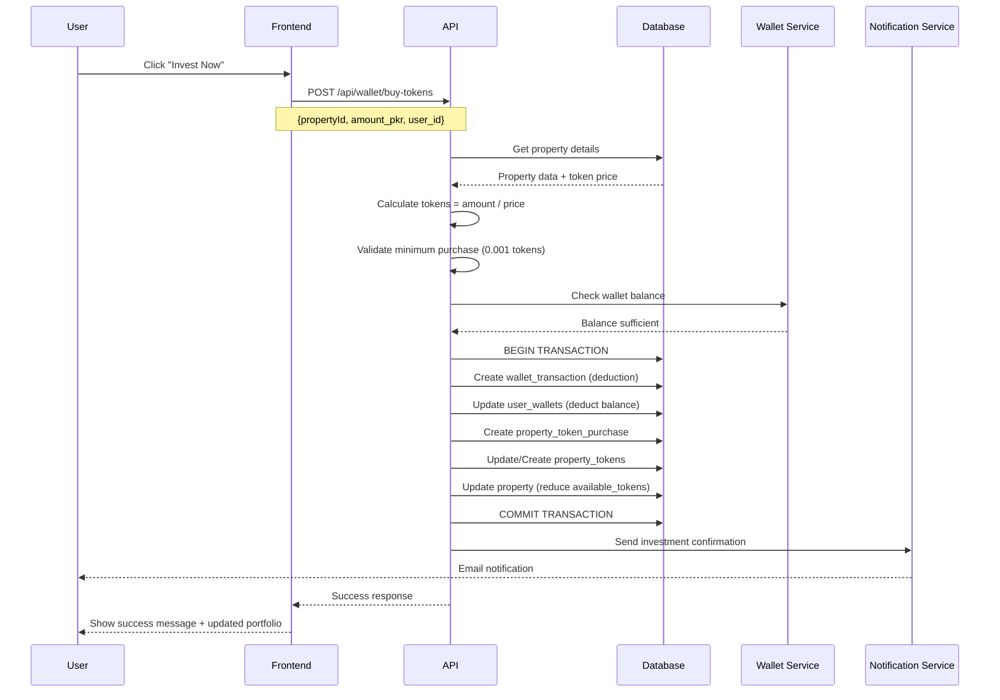
```mermaid
sequenceDiagram
    participant U as User
    participant F as Frontend
    participant A as API
    participant DB as Database
    participant W as Wallet Service
    participant N as Notification Service
    
    U->>F: Click "Invest Now"
    F->>A: POST /api/wallet/buy-tokens
    Note over F,A: {propertyId, amount_pkr, user_id}
    
    A->>DB: Get property details
    DB-->>A: Property data + token price
    
    A->>A: Calculate tokens = amount / price
    A->>A: Validate minimum purchase (0.001 tokens)
    
    A->>W: Check wallet balance
    W-->>A: Balance sufficient
    
    A->>DB: BEGIN TRANSACTION
    
    A->>DB: Create wallet_transaction (deduction)
    A->>DB: Update user_wallets (deduct balance)
    A->>DB: Create property_token_purchase
    A->>DB: Update/Create property_tokens
    A->>DB: Update property (reduce available_tokens)
    
    A->>DB: COMMIT TRANSACTION
    
    A->>N: Send investment confirmation
    N-->>U: Email notification
    
    A-->>F: Success response
    F-->>U: Show success message + updated portfolio
```

---

## Wallet Operations

### Wallet Deposit Flow

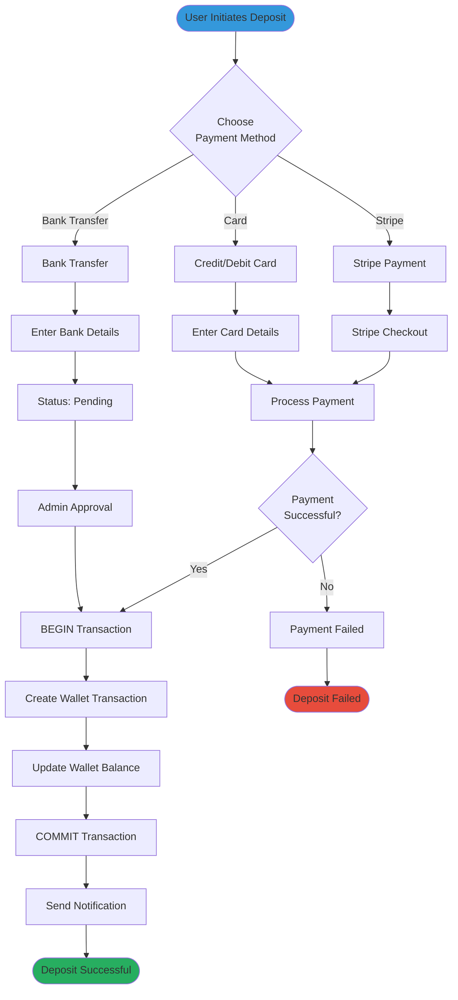
```mermaid
flowchart TD
    START([User Initiates Deposit]) --> METHOD{Choose<br/>Payment Method}
    
    METHOD -->|Bank Transfer| BANK[Bank Transfer]
    METHOD -->|Card| CARD[Credit/Debit Card]
    METHOD -->|Stripe| STRIPE[Stripe Payment]
    
    BANK --> BANKDETAILS[Enter Bank Details]
    CARD --> CARDDETAILS[Enter Card Details]
    STRIPE --> STRIPECHECKOUT[Stripe Checkout]
    
    BANKDETAILS --> PENDING[Status: Pending]
    PENDING --> ADMINAPPROVE[Admin Approval]
    ADMINAPPROVE --> TXBEGIN
    
    CARDDETAILS --> PROCESS[Process Payment]
    STRIPECHECKOUT --> PROCESS
    
    PROCESS --> PAYSUCCESS{Payment<br/>Successful?}
    PAYSUCCESS -->|No| PAYFAIL[Payment Failed]
    PAYSUCCESS -->|Yes| TXBEGIN[BEGIN Transaction]
    
    TXBEGIN --> CREATETX[Create Wallet Transaction]
    CREATETX --> UPDATEBAL[Update Wallet Balance]
    UPDATEBAL --> TXCOMMIT[COMMIT Transaction]
    
    TXCOMMIT --> NOTIFY[Send Notification]
    NOTIFY --> SUCCESS([Deposit Successful])
    
    PAYFAIL --> END([Deposit Failed])
    
    style START fill:#3498DB
    style SUCCESS fill:#27AE60
    style END fill:#E74C3C
```

### Wallet Withdrawal Flow

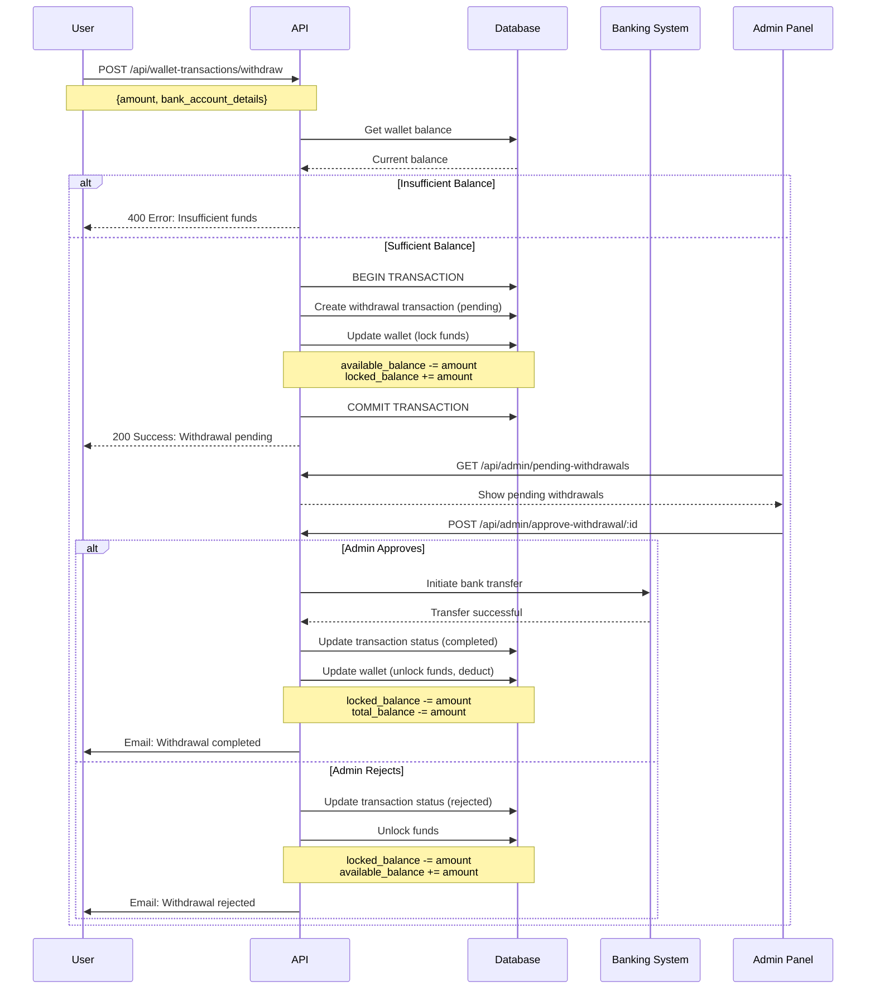
```mermaid
sequenceDiagram
    participant U as User
    participant A as API
    participant DB as Database
    participant Bank as Banking System
    participant Admin as Admin Panel
    
    U->>A: POST /api/wallet-transactions/withdraw
    Note over U,A: {amount, bank_account_details}
    
    A->>DB: Get wallet balance
    DB-->>A: Current balance
    
    alt Insufficient Balance
        A-->>U: 400 Error: Insufficient funds
    else Sufficient Balance
        A->>DB: BEGIN TRANSACTION
        A->>DB: Create withdrawal transaction (pending)
        A->>DB: Update wallet (lock funds)
        Note over A,DB: available_balance -= amount<br/>locked_balance += amount
        A->>DB: COMMIT TRANSACTION
        A-->>U: 200 Success: Withdrawal pending
        
        Admin->>A: GET /api/admin/pending-withdrawals
        A-->>Admin: Show pending withdrawals
        Admin->>A: POST /api/admin/approve-withdrawal/:id
        
        alt Admin Approves
            A->>Bank: Initiate bank transfer
            Bank-->>A: Transfer successful
            A->>DB: Update transaction status (completed)
            A->>DB: Update wallet (unlock funds, deduct)
            Note over A,DB: locked_balance -= amount<br/>total_balance -= amount
            A->>U: Email: Withdrawal completed
        else Admin Rejects
            A->>DB: Update transaction status (rejected)
            A->>DB: Unlock funds
            Note over A,DB: locked_balance -= amount<br/>available_balance += amount
            A->>U: Email: Withdrawal rejected
        end
    end
```

### Wallet Balance State

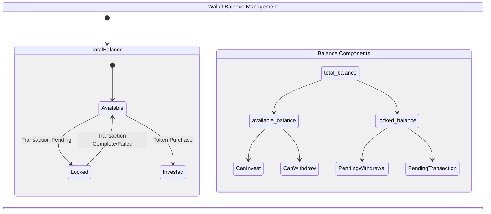
```mermaid
stateDiagram-v2
    state "Wallet Balance Management" as WBM
    
    state WBM {
        [*] --> TotalBalance
        
        state TotalBalance {
            [*] --> Available
            Available --> Locked: Transaction Pending
            Locked --> Available: Transaction Complete/Failed
            Available --> Invested: Token Purchase
        }
        
        state "Balance Components" as BC {
            total_balance --> available_balance
            total_balance --> locked_balance
            available_balance --> CanInvest
            available_balance --> CanWithdraw
            locked_balance --> PendingWithdrawal
            locked_balance --> PendingTransaction
        }
    }
```

---

## KYC Process

### KYC Submission Flow

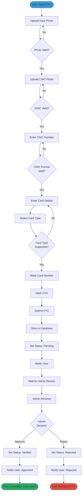
```mermaid
flowchart TD
    START([User Starts KYC]) --> UPLOAD1[Upload Face Photo]
    UPLOAD1 --> VALIDATE1{Photo Valid?}
    VALIDATE1 -->|No| UPLOAD1
    VALIDATE1 -->|Yes| UPLOAD2[Upload CNIC Photo]
    
    UPLOAD2 --> VALIDATE2{CNIC Valid?}
    VALIDATE2 -->|No| UPLOAD2
    VALIDATE2 -->|Yes| ENTERCNIC[Enter CNIC Number]
    
    ENTERCNIC --> VALIDATE3{CNIC Format<br/>Valid?}
    VALIDATE3 -->|No| ENTERCNIC
    VALIDATE3 -->|Yes| ENTERCARD[Enter Card Details]
    
    ENTERCARD --> DETECTCARD[Detect Card Type]
    DETECTCARD --> VALIDATECARD{Card Type<br/>Supported?}
    VALIDATECARD -->|No| ENTERCARD
    VALIDATECARD -->|Yes| MASKCARD[Mask Card Number]
    
    MASKCARD --> HASHCVV[Hash CVV]
    HASHCVV --> SUBMIT[Submit KYC]
    
    SUBMIT --> STORE[Store in Database]
    STORE --> SETSTATUS[Set Status: Pending]
    SETSTATUS --> NOTIFY[Notify User]
    NOTIFY --> WAITREVIEW[Wait for Admin Review]
    
    WAITREVIEW --> ADMIN[Admin Reviews]
    ADMIN --> DECISION{Admin<br/>Decision}
    
    DECISION -->|Approve| APPROVED[Set Status: Verified]
    DECISION -->|Reject| REJECTED[Set Status: Rejected]
    
    APPROVED --> NOTIFYAPPROVE[Notify User: Approved]
    REJECTED --> NOTIFYREJECT[Notify User: Rejected]
    
    NOTIFYAPPROVE --> SUCCESS([KYC Complete - Can Invest])
    NOTIFYREJECT --> CANRESUBMIT([Can Resubmit KYC])
    
    style START fill:#3498DB
    style SUCCESS fill:#27AE60
    style CANRESUBMIT fill:#E74C3C
```

### KYC Data Flow

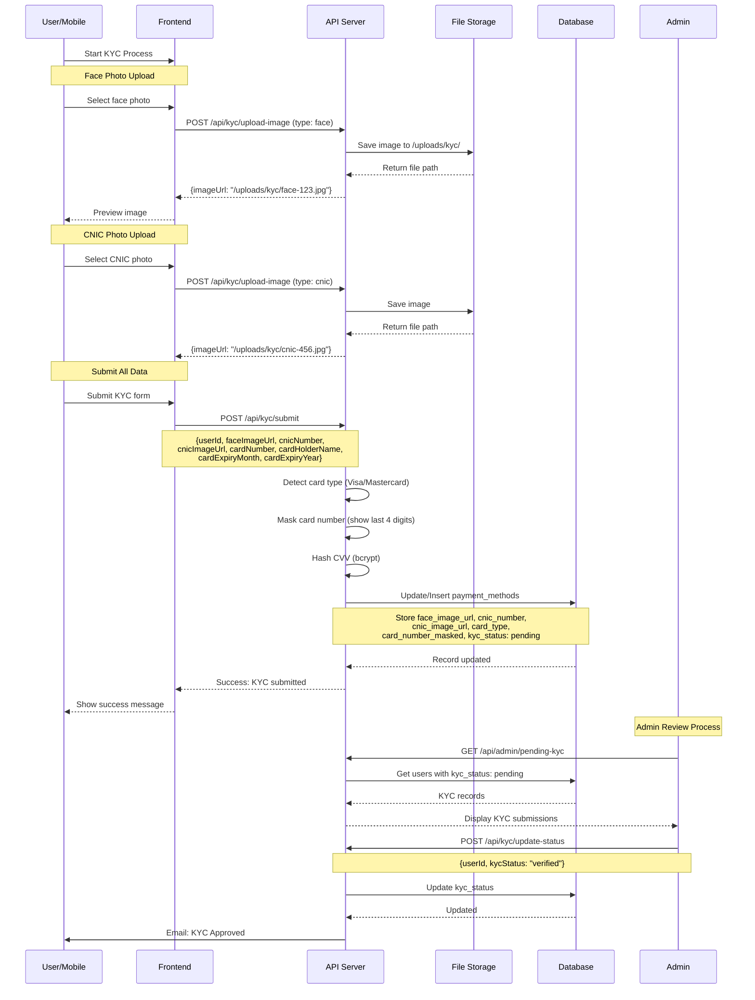
```mermaid
sequenceDiagram
    participant U as User/Mobile
    participant F as Frontend
    participant API as API Server
    participant FS as File Storage
    participant DB as Database
    participant A as Admin
    
    U->>F: Start KYC Process
    
    Note over U,F: Face Photo Upload
    U->>F: Select face photo
    F->>API: POST /api/kyc/upload-image (type: face)
    API->>FS: Save image to /uploads/kyc/
    FS-->>API: Return file path
    API-->>F: {imageUrl: "/uploads/kyc/face-123.jpg"}
    F-->>U: Preview image
    
    Note over U,F: CNIC Photo Upload
    U->>F: Select CNIC photo
    F->>API: POST /api/kyc/upload-image (type: cnic)
    API->>FS: Save image
    FS-->>API: Return file path
    API-->>F: {imageUrl: "/uploads/kyc/cnic-456.jpg"}
    
    Note over U,F: Submit All Data
    U->>F: Submit KYC form
    F->>API: POST /api/kyc/submit
    Note over F,API: {userId, faceImageUrl, cnicNumber,<br/>cnicImageUrl, cardNumber, cardHolderName,<br/>cardExpiryMonth, cardExpiryYear}
    
    API->>API: Detect card type (Visa/Mastercard)
    API->>API: Mask card number (show last 4 digits)
    API->>API: Hash CVV (bcrypt)
    
    API->>DB: Update/Insert payment_methods
    Note over API,DB: Store face_image_url, cnic_number,<br/>cnic_image_url, card_type,<br/>card_number_masked, kyc_status: pending
    
    DB-->>API: Record updated
    API-->>F: Success: KYC submitted
    F-->>U: Show success message
    
    Note over A: Admin Review Process
    A->>API: GET /api/admin/pending-kyc
    API->>DB: Get users with kyc_status: pending
    DB-->>API: KYC records
    API-->>A: Display KYC submissions
    
    A->>API: POST /api/kyc/update-status
    Note over A,API: {userId, kycStatus: "verified"}
    API->>DB: Update kyc_status
    DB-->>API: Updated
    API->>U: Email: KYC Approved
```

---

## Admin Operations

### Admin Dashboard Data Aggregation

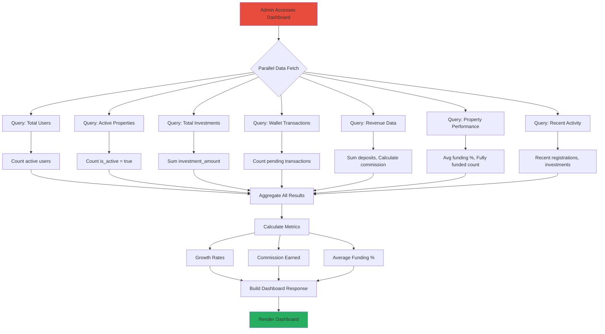
```mermaid
graph TD
    ADMIN[Admin Accesses Dashboard] --> PARALLEL{Parallel Data Fetch}
    
    PARALLEL --> Q1[Query: Total Users]
    PARALLEL --> Q2[Query: Active Properties]
    PARALLEL --> Q3[Query: Total Investments]
    PARALLEL --> Q4[Query: Wallet Transactions]
    PARALLEL --> Q5[Query: Revenue Data]
    PARALLEL --> Q6[Query: Property Performance]
    PARALLEL --> Q7[Query: Recent Activity]
    
    Q1 --> A1[Count active users]
    Q2 --> A2[Count is_active = true]
    Q3 --> A3[Sum investment_amount]
    Q4 --> A4[Count pending transactions]
    Q5 --> A5[Sum deposits, Calculate commission]
    Q6 --> A6[Avg funding %, Fully funded count]
    Q7 --> A7[Recent registrations, investments]
    
    A1 --> AGGREGATE[Aggregate All Results]
    A2 --> AGGREGATE
    A3 --> AGGREGATE
    A4 --> AGGREGATE
    A5 --> AGGREGATE
    A6 --> AGGREGATE
    A7 --> AGGREGATE
    
    AGGREGATE --> CALCULATE[Calculate Metrics]
    CALCULATE --> GROWTH[Growth Rates]
    CALCULATE --> COMMISSION[Commission Earned]
    CALCULATE --> AVGFUND[Average Funding %]
    
    GROWTH --> RESPONSE[Build Dashboard Response]
    COMMISSION --> RESPONSE
    AVGFUND --> RESPONSE
    
    RESPONSE --> RENDER[Render Dashboard]
    
    style ADMIN fill:#E74C3C
    style RENDER fill:#27AE60
```

### Property Management by Admin

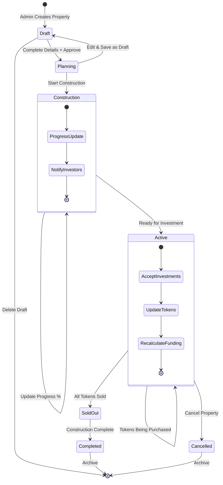
```mermaid
stateDiagram-v2
    [*] --> Draft: Admin Creates Property
    
    Draft --> Planning: Complete Details + Approve
    Draft --> [*]: Delete Draft
    
    Planning --> Construction: Start Construction
    Planning --> Draft: Edit & Save as Draft
    
    Construction --> Active: Ready for Investment
    Construction --> Construction: Update Progress %
    
    Active --> Active: Tokens Being Purchased
    Active --> SoldOut: All Tokens Sold
    Active --> Cancelled: Cancel Property
    
    SoldOut --> Completed: Construction Complete
    
    Completed --> [*]: Archive
    Cancelled --> [*]: Archive
    
    state Construction {
        [*] --> ProgressUpdate
        ProgressUpdate --> NotifyInvestors
        NotifyInvestors --> [*]
    }
    
    state Active {
        [*] --> AcceptInvestments
        AcceptInvestments --> UpdateTokens
        UpdateTokens --> RecalculateFunding
        RecalculateFunding --> [*]
    }
```

### Admin Approval Workflows

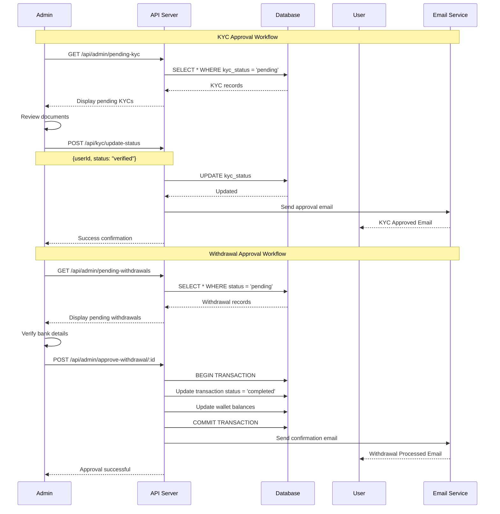
```mermaid
sequenceDiagram
    participant A as Admin
    participant API as API Server
    participant DB as Database
    participant U as User
    participant E as Email Service
    
    Note over A,E: KYC Approval Workflow
    A->>API: GET /api/admin/pending-kyc
    API->>DB: SELECT * WHERE kyc_status = 'pending'
    DB-->>API: KYC records
    API-->>A: Display pending KYCs
    
    A->>A: Review documents
    A->>API: POST /api/kyc/update-status
    Note over A,API: {userId, status: "verified"}
    API->>DB: UPDATE kyc_status
    DB-->>API: Updated
    API->>E: Send approval email
    E-->>U: KYC Approved Email
    API-->>A: Success confirmation
    
    Note over A,E: Withdrawal Approval Workflow
    A->>API: GET /api/admin/pending-withdrawals
    API->>DB: SELECT * WHERE status = 'pending'
    DB-->>API: Withdrawal records
    API-->>A: Display pending withdrawals
    
    A->>A: Verify bank details
    A->>API: POST /api/admin/approve-withdrawal/:id
    API->>DB: BEGIN TRANSACTION
    API->>DB: Update transaction status = 'completed'
    API->>DB: Update wallet balances
    API->>DB: COMMIT TRANSACTION
    API->>E: Send confirmation email
    E-->>U: Withdrawal Processed Email
    API-->>A: Approval successful
```

---

## Data Models

### User Entity Relationships

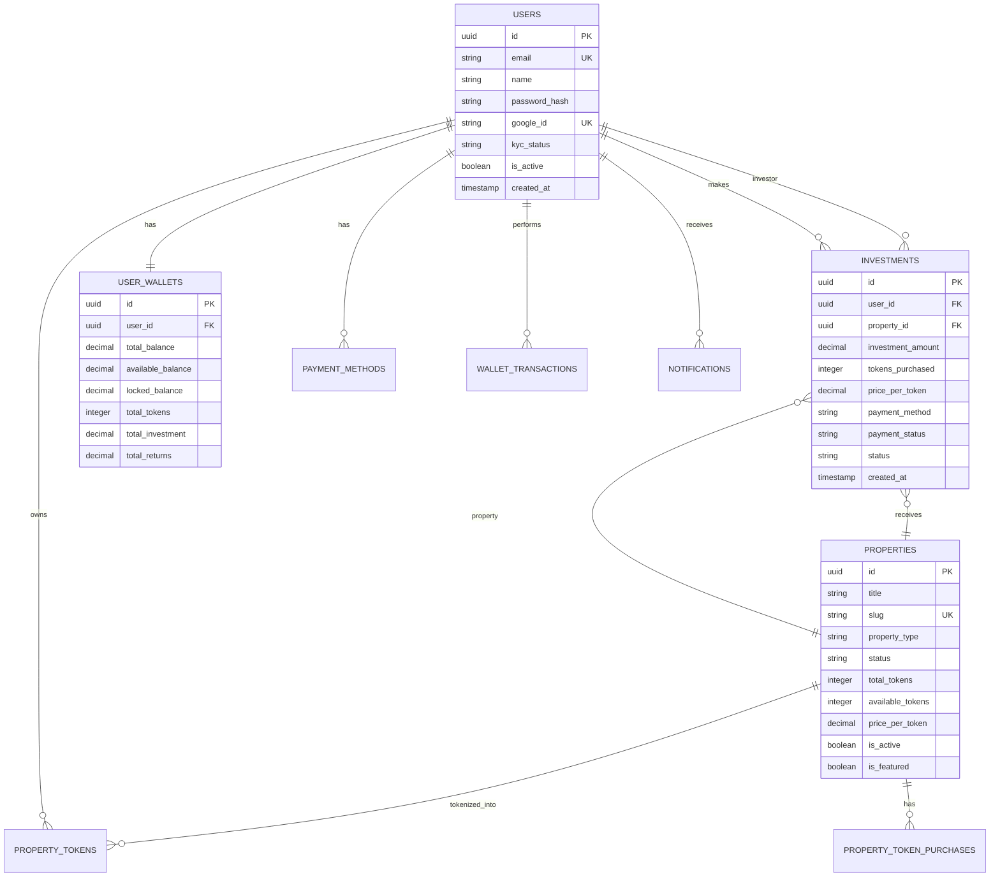
```mermaid
erDiagram
    USERS ||--o{ INVESTMENTS : makes
    USERS ||--|| USER_WALLETS : has
    USERS ||--o{ PAYMENT_METHODS : has
    USERS ||--o{ WALLET_TRANSACTIONS : performs
    USERS ||--o{ PROPERTY_TOKENS : owns
    USERS ||--o{ NOTIFICATIONS : receives
    
    PROPERTIES ||--o{ INVESTMENTS : receives
    PROPERTIES ||--o{ PROPERTY_TOKENS : tokenized_into
    PROPERTIES ||--o{ PROPERTY_TOKEN_PURCHASES : has
    
    INVESTMENTS }o--|| PROPERTIES : property
    INVESTMENTS }o--|| USERS : investor
    
    USERS {
        uuid id PK
        string email UK
        string name
        string password_hash
        string google_id UK
        string kyc_status
        boolean is_active
        timestamp created_at
    }
    
    PROPERTIES {
        uuid id PK
        string title
        string slug UK
        string property_type
        string status
        integer total_tokens
        integer available_tokens
        decimal price_per_token
        boolean is_active
        boolean is_featured
    }
    
    INVESTMENTS {
        uuid id PK
        uuid user_id FK
        uuid property_id FK
        decimal investment_amount
        integer tokens_purchased
        decimal price_per_token
        string payment_method
        string payment_status
        string status
        timestamp created_at
    }
    
    USER_WALLETS {
        uuid id PK
        uuid user_id FK
        decimal total_balance
        decimal available_balance
        decimal locked_balance
        integer total_tokens
        decimal total_investment
        decimal total_returns
    }
```

### Investment State Transitions

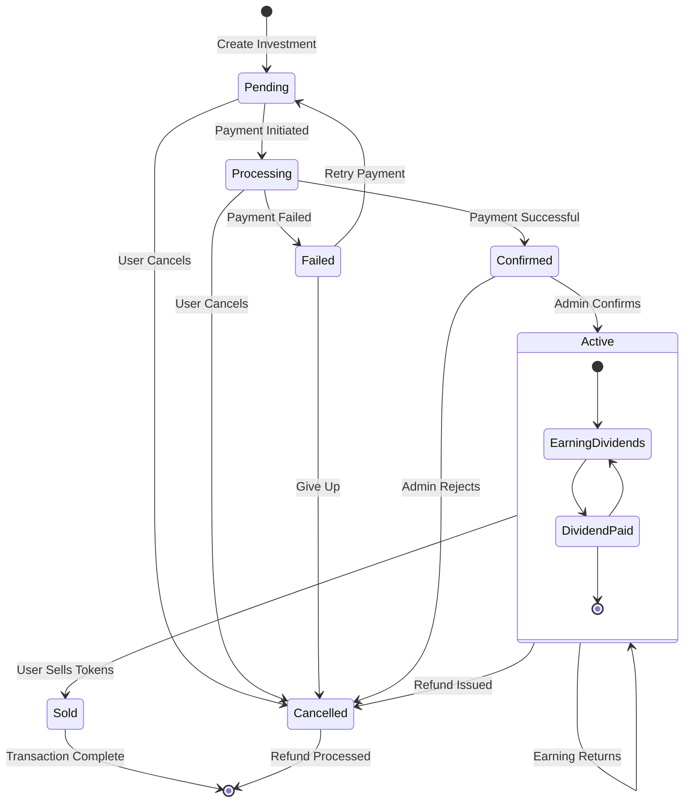
```mermaid
stateDiagram-v2
    [*] --> Pending: Create Investment
    
    Pending --> Processing: Payment Initiated
    Pending --> Cancelled: User Cancels
    
    Processing --> Confirmed: Payment Successful
    Processing --> Failed: Payment Failed
    Processing --> Cancelled: User Cancels
    
    Failed --> Pending: Retry Payment
    Failed --> Cancelled: Give Up
    
    Confirmed --> Active: Admin Confirms
    Confirmed --> Cancelled: Admin Rejects
    
    Active --> Active: Earning Returns
    Active --> Sold: User Sells Tokens
    Active --> Cancelled: Refund Issued
    
    Sold --> [*]: Transaction Complete
    Cancelled --> [*]: Refund Processed
    
    state Active {
        [*] --> EarningDividends
        EarningDividends --> DividendPaid
        DividendPaid --> EarningDividends
        DividendPaid --> [*]
    }
```

### Wallet Transaction Flow

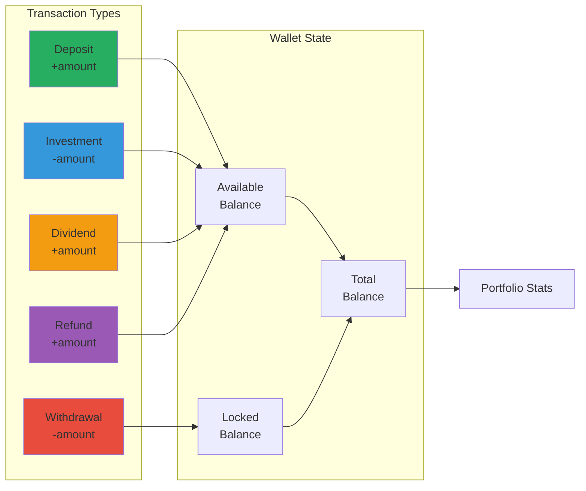
```mermaid
flowchart LR
    subgraph "Transaction Types"
        DEP[Deposit<br/>+amount]
        WITH[Withdrawal<br/>-amount]
        INV[Investment<br/>-amount]
        DIV[Dividend<br/>+amount]
        REF[Refund<br/>+amount]
    end
    
    subgraph "Wallet State"
        AVAIL[Available<br/>Balance]
        LOCKED[Locked<br/>Balance]
        TOTAL[Total<br/>Balance]
    end
    
    DEP --> AVAIL
    WITH --> LOCKED
    INV --> AVAIL
    DIV --> AVAIL
    REF --> AVAIL
    
    AVAIL --> TOTAL
    LOCKED --> TOTAL
    
    TOTAL --> STATS[Portfolio Stats]
    
    style DEP fill:#27AE60
    style WITH fill:#E74C3C
    style INV fill:#3498DB
    style DIV fill:#F39C12
    style REF fill:#9B59B6
```

---

## Complete User Journey

### End-to-End User Experience

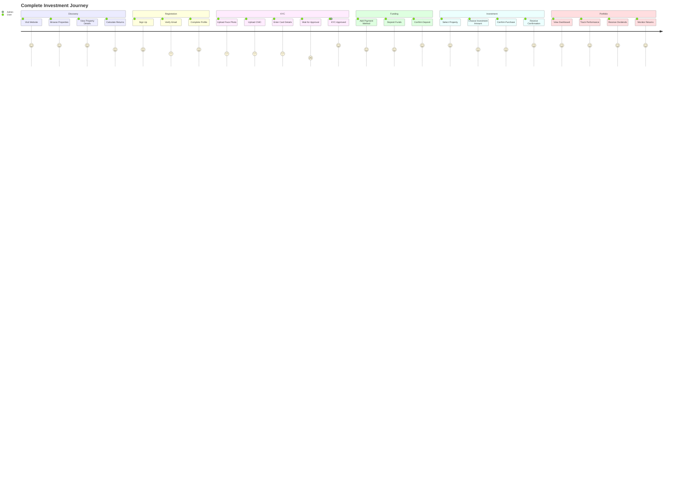
```mermaid
journey
    title Complete Investment Journey
    section Discovery
      Visit Website: 5: User
      Browse Properties: 5: User
      View Property Details: 5: User
      Calculate Returns: 4: User
    section Registration
      Sign Up: 4: User
      Verify Email: 3: User
      Complete Profile: 4: User
    section KYC
      Upload Face Photo: 3: User
      Upload CNIC: 3: User
      Enter Card Details: 3: User
      Wait for Approval: 2: User
      KYC Approved: 5: User, Admin
    section Funding
      Add Payment Method: 4: User
      Deposit Funds: 4: User
      Confirm Deposit: 5: User
    section Investment
      Select Property: 5: User
      Choose Investment Amount: 4: User
      Confirm Purchase: 4: User
      Receive Confirmation: 5: User
    section Portfolio
      View Dashboard: 5: User
      Track Performance: 5: User
      Receive Dividends: 5: User
      Monitor Returns: 5: User
```

### Mobile App Flow

```mermaid
graph TD
    SPLASH[Splash Screen] --> ONBOARD{First Time?}
    ONBOARD -->|Yes| ONBOARDING[Onboarding Slides]
    ONBOARD -->|No| CHECKAUTH{Logged In?}
    
    ONBOARDING --> LOGIN[Login/Register]
    CHECKAUTH -->|No| LOGIN
    CHECKAUTH -->|Yes| DASHBOARD
    
    LOGIN --> AUTH{Choose Method}
    AUTH -->|Email| EMAILAUTH[Email/Password]
    AUTH -->|Google| GOOGLEAUTH[Google OAuth]
    
    EMAILAUTH --> DASHBOARD[Main Dashboard]
    GOOGLEAUTH --> DASHBOARD
    
    DASHBOARD --> NAV{Navigation}
    
    NAV --> HOME[Home/Properties]
    NAV --> PORT[Portfolio]
    NAV --> WALLET[Wallet]
    NAV --> PROFILE[Profile]
    
    HOME --> PROPDETAIL[Property Details]
    PROPDETAIL --> INVEST[Invest]
    
    INVEST --> KYCCHECK{KYC Verified?}
    KYCCHECK -->|No| KYCFLOW[KYC Submission]
    KYCCHECK -->|Yes| WALLETCHECK{Wallet Balance?}
    
    WALLETCHECK -->|Insufficient| ADDMONEY[Add Money]
    WALLETCHECK -->|Sufficient| CONFIRM[Confirm Investment]
    
    ADDMONEY --> PAYMENT[Payment Gateway]
    PAYMENT --> CONFIRM
    
    CONFIRM --> SUCCESS[Success Screen]
    SUCCESS --> DASHBOARD
    
    style DASHBOARD fill:#3498DB
    style SUCCESS fill:#27AE60
    style KYCFLOW fill:#E67E22
```

---

## Performance & Optimization

### Database Query Optimization

```mermaid
graph TD
    QUERY[API Request] --> CACHE{Check Cache?}
    
    CACHE -->|Hit| RETURN[Return Cached Data]
    CACHE -->|Miss| DB[Query Database]
    
    DB --> INDEX{Use Index?}
    INDEX -->|Yes| FAST[Fast Query<br/>< 10ms]
    INDEX -->|No| SLOW[Slow Query<br/>> 100ms]
    
    FAST --> RESULT[Return Result]
    SLOW --> OPTIMIZE[Need Optimization]
    
    RESULT --> UPDATECACHE[Update Cache]
    UPDATECACHE --> RETURN
    
    OPTIMIZE --> ADDINDEX[Add Index]
    ADDINDEX --> FAST
    
    style FAST fill:#27AE60
    style SLOW fill:#E74C3C
    style CACHE fill:#F39C12
```

### Transaction Processing

```mermaid
sequenceDiagram
    participant C as Client
    participant A as API
    participant DB as Database
    participant Q as Queue (Planned)
    
    C->>A: Investment Request
    A->>A: Validate Input
    
    Note over A,DB: Synchronous Critical Path
    A->>DB: BEGIN TRANSACTION
    A->>DB: Lock rows (FOR UPDATE)
    A->>DB: Validate balances
    A->>DB: Update wallet
    A->>DB: Create investment
    A->>DB: Update property
    A->>DB: COMMIT
    
    DB-->>A: Transaction Success
    A-->>C: 201 Created (immediate response)
    
    Note over A,Q: Asynchronous Non-Critical
    A->>Q: Queue notification job
    A->>Q: Queue analytics update
    A->>Q: Queue email send
    
    Q-->>C: Email notification (later)
```

---

## Security Architecture

### Authentication & Authorization Flow

```mermaid
flowchart TD
    REQUEST[API Request] --> HASTOKEN{Has Auth<br/>Header?}
    
    HASTOKEN -->|No| CHECKENDPOINT{Public<br/>Endpoint?}
    CHECKENDPOINT -->|Yes| ALLOW[Allow Access]
    CHECKENDPOINT -->|No| DENY401[401 Unauthorized]
    
    HASTOKEN -->|Yes| EXTRACT[Extract Token]
    EXTRACT --> VERIFY{Verify JWT<br/>Signature?}
    
    VERIFY -->|Invalid| DENY401
    VERIFY -->|Valid| CHECKEXP{Token<br/>Expired?}
    
    CHECKEXP -->|Yes| DENY401E[401 Token Expired]
    CHECKEXP -->|No| GETUSER[Get User from DB]
    
    GETUSER --> USEREXIST{User<br/>Exists?}
    USEREXIST -->|No| DENY401
    USEREXIST -->|Yes| CHECKACTIVE{User<br/>Active?}
    
    CHECKACTIVE -->|No| DENY401D[401 Deactivated]
    CHECKACTIVE -->|Yes| CHECKROLE{Required<br/>Role?}
    
    CHECKROLE -->|Admin Required| ISADMIN{User is<br/>Admin?}
    CHECKROLE -->|KYC Required| ISKYC{KYC<br/>Verified?}
    CHECKROLE -->|None| ALLOW
    
    ISADMIN -->|No| DENY403[403 Forbidden]
    ISADMIN -->|Yes| ALLOW
    
    ISKYC -->|No| DENY403K[403 KYC Required]
    ISKYC -->|Yes| ALLOW
    
    ALLOW --> PROCESS[Process Request]
    
    style ALLOW fill:#27AE60
    style DENY401 fill:#E74C3C
    style DENY403 fill:#E74C3C
    style PROCESS fill:#3498DB
```

### Data Encryption Flow

```mermaid
graph LR
    subgraph "Input Data"
        PASS[Password]
        CVV[CVV]
        CARD[Card Number]
        CNIC[CNIC]
    end
    
    subgraph "Encryption/Hashing"
        PASS --> BCRYPT[bcrypt Hash<br/>12 rounds]
        CVV --> BCRYPTH[bcrypt Hash<br/>10 rounds]
        CARD --> MASK[Mask<br/>Last 4 digits]
        CNIC --> STORE[Store Encrypted]
    end
    
    subgraph "Storage"
        BCRYPT --> DBPASS[(password_hash)]
        BCRYPTH --> DBCVV[(cvv_hash)]
        MASK --> DBCARD[(card_number_masked)]
        STORE --> DBCNIC[(cnic_number)]
    end
    
    subgraph "Verification"
        DBPASS --> COMPARE[bcrypt.compare]
        DBCVV --> COMPARE
    end
    
    style BCRYPT fill:#E74C3C
    style BCRYPTH fill:#E74C3C
    style MASK fill:#F39C12
```

---

## Monitoring & Logging

### Application Monitoring

```mermaid
graph TD
    APP[Application] --> MORGAN[Morgan<br/>HTTP Logger]
    APP --> CONSOLE[Console<br/>Logs]
    APP --> ERROR[Error<br/>Handler]
    
    MORGAN --> STDOUT[stdout]
    CONSOLE --> STDOUT
    ERROR --> STDERR[stderr]
    
    STDOUT --> LOGFILE[Log Files]
    STDERR --> LOGFILE
    
    LOGFILE --> ANALYTICS[Analytics<br/>Planned]
    
    APP --> HEALTH[Health Check<br/>/health]
    HEALTH --> MONITOR[Monitoring<br/>Service]
    
    MONITOR --> ALERT{Anomaly?}
    ALERT -->|Yes| NOTIFY[Alert Admin]
    ALERT -->|No| TRACK[Track Metrics]
    
    style ERROR fill:#E74C3C
    style NOTIFY fill:#E67E22
```

---

This comprehensive flowchart documentation provides visual representations of all major business processes, data flows, and system interactions in the HMR Builders Real Estate Tokenization Platform.

**Document Version:** 1.0  
**Last Updated:** 2025-10-16  
**Format:** Mermaid Diagrams
